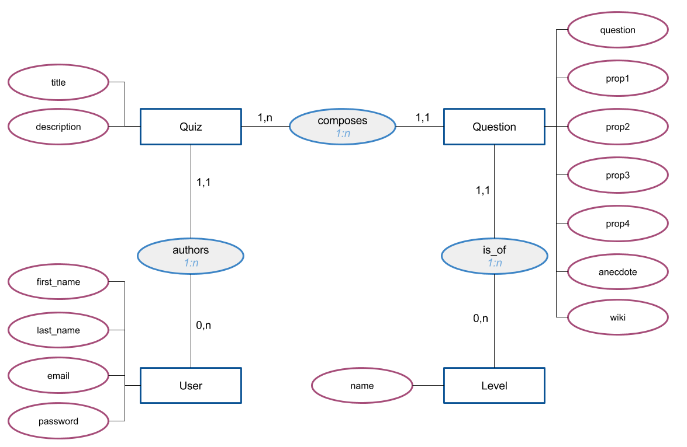

# O'Quiz
*compétences TP: développer une interface utilisateur, développer des composants d’accès aux données, développer des pages web en lien avec une base de données*

## Objectif
Votre ami a eu cette idée d'appli web mais n'arrive pas à la mettre en oeuvre:  
Il s'agit de permettre à ses visiteurs de consulter des quizzes sur des sujets divers, et de pouvoir y jouer en s'étant inscrit au préalable.  
Il a déjà créé une base de données avec quelques quiz. Vous êtes chargé de faire le premier prototype 🔨👷
**Votre objectif est d'avoir un prototype fonctionnel, pas encore de travailler sur le design, la priorité est de faire le développement back ici. L'intégration n'est pas l'objectif de cette évaluation.**
Néanmoins, ça ne vous dispense pas de proposer du html et css propres, et pourquoi pas d'ajouter un peu de JS ici et là (!BONUS!).

## Description du projet
**O'Quiz** est une application simple de quiz.  
En arrivant sur la page d'accueil, les visiteurs voient la liste des quiz disponibles.  
Un lien leur permet également de se connecter.  
En cliquant sur le titre d'un quiz, on consulte le détail d'un quiz.
Sur la page d'un quiz s'affichent les infos du quiz et la liste de questions.  
Les visiteurs non connectés peuvent seulement consulter la liste des questions, alors que les visiteurs connectés peuvent jouer (grâce à un formulaire).   
Lorsqu'un visiteur se connecte il est redirigé vers la page d'accueil (liste des quiz).  
Cliquer sur un quiz permet alors aux visiteurs connectés d'aller jouer:
  - Toutes les questions sont listées sur la page.
  - Pour chaque questions, 4 boutons radio permettent de choisir une des 4 réponses.
  - En bas de la page un bouton permet de soumettre ses réponses et d'afficher son résultat.
A l'affichage du résultat:
  - le score total est affiché (nombre de bonnes réponses / nombre total de qustions)
  - chaque question est colorée


```
 /              home : la liste des quiz disponibles
 |_  /quiz/8     page d'un quiz (consulter ou jouer)
 |_  /signup/    inscription
 |_  /signin/    connection
 |_  /compte/    profil user (accessible seulement à l'user connecté)
```

### instructions
* avec phpMyAdmin, créer un utilisateur et une base de données sur laquelle il a tous les droits.  
* importer dans cette BD la structure (`sql/oquiz-struct.sql`) puis les données (`sql/oquiz-data.sql`).
* créez la structure de fichiers dont vous avez besoin pour le projet:
  - utilisez composer pour la gestion des dépendances et le chargement de vos classes
  - Technologies à utiliser:
    - Vous utiliserez de l'objet partout (où c'est possible)
    - de préférence le *pattern* MVC vu dans les projets (un FrontController, Controller(s), Model(s) pour l'accès aux données, moteur de templates)
    - Altorouter (ou autre librairie de routage / choix technique à justifier dans le README)
    - Plates pour la gestion des templates (ou autre librairie de templating / choix technique à justifier dans le README)
  - et, pour ne pas vous rajouter de la #detteTechnique par la suite, vous respecterez globalement les bonnes pratiques en vigueur
* utilisez Bootstrap si vous souhaitez styler rapidement votre proto. Ne cherchez pas à coller aux maquettes visuellement, mais faites quelque chose de propre.

### données
* Un quizz est créé par un utilisateur, et est composé de plusieurs questions.
* Chaque question possède 4 propositions, dont une seule correcte. En base de données la réponse correcte est dans le champ `prop1` de la table `questions`.  
* Les questions sont caractérisées par un niveau de difficulté
* La base de données contient également les données relatives aux utilisateurs du site.

Schéma de la base de données :



#### Utilisateurs
2 utilisateurs de test sont déjà inscrits en base de données:
* philippe@oclock.io - quizoclock
* chuck@oclock.io - quizoclock

## Instructions
* Voilà l'ordre des priorités pour les fonctionnalités à developper :
  1. la page d'accueil [instructions](docs/page-accueil.md)
  2. la page de consultation d'un quiz [instructions](docs/quiz-consulter.md)
  3. login-logout [instructions](docs/authentification.md)
  4. le système de quiz! [instructions](docs/quiz-jeu.md)

* **BONUS**
Votre ami, est pas très bon en PHP, par contre il a plein d'idées pour améliorer le proto :
- une page profil qui permet aux utilisateurs de voir les quiz dont ils sont auteurs
- une page qui permet de créer un quiz (quand on est identifié)
- un petit look css sympa pour le site 💅

## Quelques conseils
* Lisez tout l’énoncé dès le début, pour savoir où vous allez.
* Prenez le temps de coder, en commentant votre code dès qu’il est nécessaire, pourquoi pas en copiant la consigne en commentaire.
* Gardez des fonctions simples, qui ne font qu’une seule chose, pour mieux vous y retrouver.
* Plus les premières étapes seront bien codées, plus la suite sera facile !
